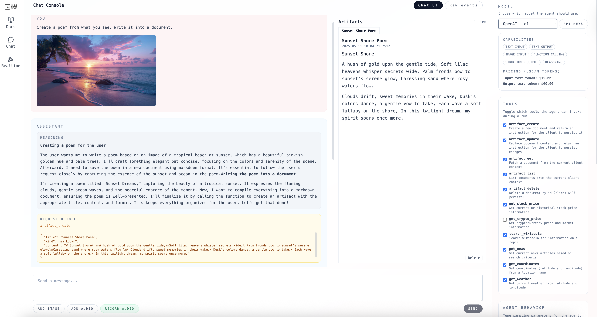

# Website

This folder contains the source code for the website of the project, which includes a documentation site and a demo console application.

## Development

To run the website locally, navigate to this directory and use the following command:

```bash
npm run dev
```

This will start a local development server, and you can view the website in your web browser at `http://localhost:4321`.

## Console Application



To use the demo console application, start one of the example backend servers in a separate terminal window:

```bash
cd ../agent-js && node examples/server.js
# or
cd ../agent-rust && cargo run --example server
# or
cd ../agent-go && go run ./examples/server
```

Visit `http://localhost:4321/console/chat` in your web browser to access the console application.

## Real-time Console Application


In addition to the chat console, there is also a real-time interactive application available at http://localhost:4321/console/realtime. This application allows for real-time voice interactions using the device's microphone. The real-time logic is implemented in the frontend with [a VAD model](https://github.com/snakers4/silero-vad), but it can be implemented in the backend in a similar manner. It uses the same `Agent` class to power the interactions.

This is similar to [OpenAI Realtime API](https://platform.openai.com/docs/guides/realtime), except it uses a regular multi-modal LLM (e.g., `gpt-4o-audio-preview`) instead of a specialized real-time model like `gpt-4o-realtime` and implements without lock-in to any specific vendor.

It is also possible to create a custom `LanguageModel` class that combines a text LLM (e.g., `gpt-4o`) with a speech-to-text model (e.g., `whisper`) to achieve similar functionality while saving costs.

Visit http://localhost:4321/console/realtime in your web browser to access the real-time console application.

## Model list

A list of models selectable in the console is provided in [models.json](../example-server/models.json). You can modify this file to add or remove models as needed.
