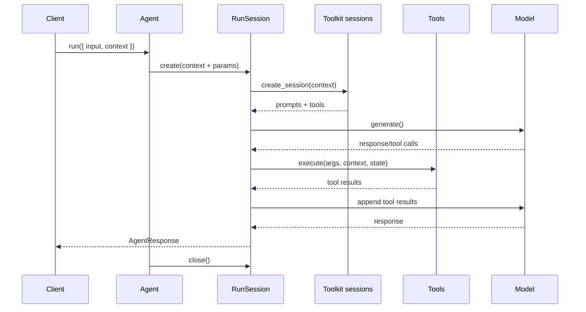

import { Code, TabItem, Tabs } from "@astrojs/starlight/components";
import {
  extractGoAgentRunTypes,
  extractGoAgentTypes,
  extractRustAgentRunTypes,
  extractRustAgentTypes,
  extractTypescriptAgentRunTypes,
  extractTypescriptAgentTypes,
} from "../../../utils/extract-types.ts";

Agents and run sessions are two halves of the same workflow. The agent describes the capability you want to expose. The run session is the stateful executor that turns that description into actual model calls, tool usage, and telemetry for a specific request or tenant.

## Agent

An agent is a reusable blueprint. It keeps the shared configuration for a capability--name, default model, instructions, tools, and optional toolkits--and remains safe to reuse across users because it never captures request-specific state.

It exposes three entry points: `run`, `run_stream`, and `create_session`. The first two spin up a temporary run session, execute exactly once, and always close it so you do not leak resources. Reach for `create_session` when you need to reuse initialized toolkits or run several calls back to back; you become responsible for closing that session afterwards.

<Code
  code={`export class Agent<TContext> {
  readonly name: string;

  constructor(params: AgentParams<TContext>);

  run(request: AgentRequest<TContext>): Promise<AgentResponse>;

  runStream(request: AgentRequest<TContext>): AsyncGenerator<AgentStreamEvent, AgentResponse>;

  createSession(context: TContext): Promise<RunSession<TContext>>;
}`}
  lang="typescript"
  title="Agent (TypeScript)"
/>

Because the agent stays stateless, every request must provide its own `context`. That value feeds dynamic instructions, toolkit factories, and tool executions without leaking across users or tenants.

## Run session

A run session binds an agent to a specific context. When it is created, the session applies parameter defaults, resolves all context-aware instructions, and asks each toolkit for a per-session instance with personalized prompts and tools. Static tools from the agent configuration are combined with toolkit-provided tools into a single roster for the run. Each call to `run` or `run_stream` starts from a clean `RunState` made from the `AgentItem[]` you pass in. The session never remembers prior inputs once the call finishes, so persist any conversation history you care about and include it explicitly on the next run.

<Code
  code={`
class RunSession<TContext> {
  run(request: RunSessionRequest): Promise<AgentResponse>;

  runStream(request: RunSessionRequest): AsyncGenerator<AgentStreamEvent, AgentResponse>;

  close(): Promise<void>;
}

interface RunSessionRequest {
  input: AgentItem[];
}`}
  lang="typescript"
  title="run.ts"
/>

Within a run session the bound context is passed to every toolkit session and tool invocation, keeping the runtime consistent for the lifetime of that session. When your workflow ends, call `close` to release toolkit resources and clear cached prompts. If you only need a single answer, stick with `agent.run` or `agent.run_stream`; otherwise reuse the session for as many runs as you need before closing it.

The flow looks like this:

`run_stream` follows the same lifecycle but emits partial deltas the moment the language model produces them. Internally the session uses a stream accumulator to turn those deltas into the final response before yielding tool events and the closing payload back to you.

A typical web request creates the agent once, derives a context for the user, opens a run session, supplies the current conversation as [`AgentItem[]`](../run#agent-items), gathers the response (streaming or not), and finally closes the session. This separation keeps per-user data explicit while letting the same agent power every tenant without risk of leakage.
