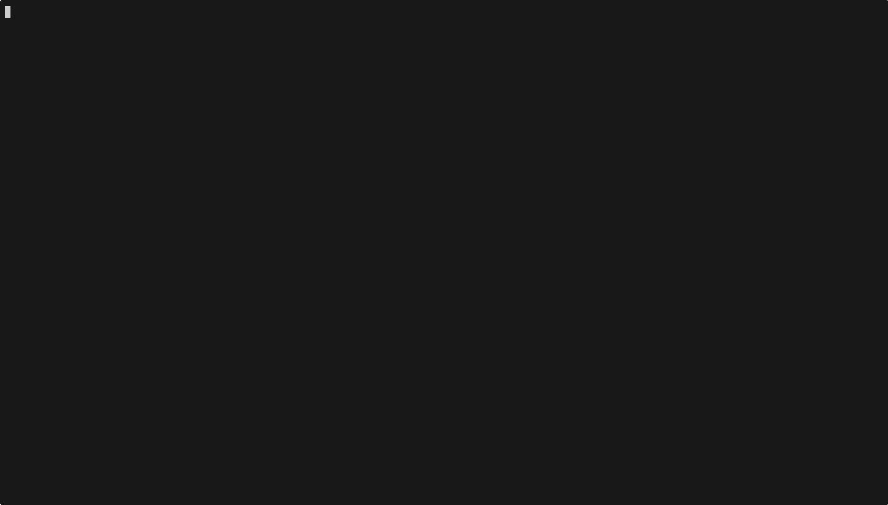

import { Aside, Code, TabItem, Tabs } from "@astrojs/starlight/components";
import goArtifactsCode from "../../../../../agent-go/examples/artifacts/main.go?raw";
import jsArtifactsCode from "../../../../../agent-js/examples/artifacts.ts?raw";
import rustArtifactsCode from "../../../../../agent-rust/examples/artifacts.rs?raw";

<Aside>
  This is an agent pattern that requires custom implementation. [Why?](/agent/#agent-patterns)
</Aside>

[Artifacts](https://www.anthropic.com/news/build-artifacts) (also known as a [“Canvas”](https://openai.com/index/introducing-canvas/)) give the agent a persistent work surface separate from the chat. Use artifacts to hold substantive deliverables (documents, specs, code), while keeping chat replies brief and status‑oriented.

You can also check out the [Console App](/console/chat) to see how artifacts are integrated into a chat interface.

The examples below implement a simple artifacts workflow using tools:

- `artifact_create` — create a new document
- `artifact_update` — replace content and print a color diff
- `artifact_get`/`artifact_list` — fetch and list documents
- `artifact_delete` — remove a document

<Tabs>
  <TabItem label="TypeScript">
    <Code code={jsArtifactsCode} lang="typescript" title="artifacts.ts" />
  </TabItem>
  <TabItem label="Rust">
    <Code code={rustArtifactsCode} lang="rust" title="artifacts.rs" />
  </TabItem>
  <TabItem label="Go">
    <Code code={goArtifactsCode} lang="go" title="main.go" />
  </TabItem>
</Tabs>

