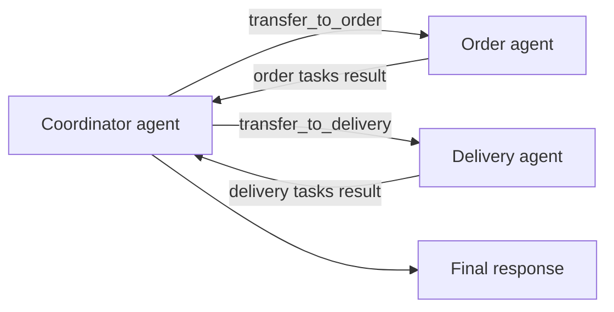

import { Aside, Code, TabItem, Tabs } from "@astrojs/starlight/components";
import goAgentsDelegationCode from "../../../../../agent-go/examples/agents-delegation/main.go?raw";
import jsAgentsDelegationCode from "../../../../../agent-js/examples/agents-delegation.ts?raw";
import rustAgentsDelegationCode from "../../../../../agent-rust/examples/agents-delegation.rs?raw";

<Aside>
  This is an agent pattern that requires custom implementation. [Why?](/agent/#agent-patterns)
</Aside>

*Agents delegation* (also called the *agent-as-tools* pattern) lets one agent hand off work to other, more specialized agents and aggregate their results. Splitting capability across focused agents keeps prompts smaller and instructions clearer, which generally makes responses faster and more accurate; by contrast, overloading a single agent with too many instructions and responsibilities can increase latency, cost, and the risk of inaccuracy or hallucination.

This example builds a simple multi-agent workflow where a coordinator delegates order creation and delivery to two specialized sub-agents.
Internally, we expose each sub-agent as a tool called `delegate` with a single parameter:

- `task`: a clear description of the work for the sub-agent, written without ambiguous pronouns so it can stand alone.

The flow works like this:

1. The coordinate agent calls the suitable sub-agent via the `transfer_to_{agent}` tool. The tool takes the task string and rewrites it into a single `UserMessage`.
2. It invokes the target agent’s run method with that message.
3. The sub-agent executes independently and returns a structured result.
4. The coordinator receives that result and uses it, along with its own reasoning, to craft a combined response for the overall workflow.

## Implementation

<Tabs>
  <TabItem label="TypeScript">
    <Code
      code={jsAgentsDelegationCode}
      lang="typescript"
      title="agents-delegation.ts"
    />
  </TabItem>
  <TabItem label="Rust">
    <Code
      code={rustAgentsDelegationCode}
      lang="rust"
      title="agents-delegation.rs"
    />
  </TabItem>
  <TabItem label="Go">
    <Code code={goAgentsDelegationCode} lang="go" title="main.go" />
  </TabItem>
</Tabs>
