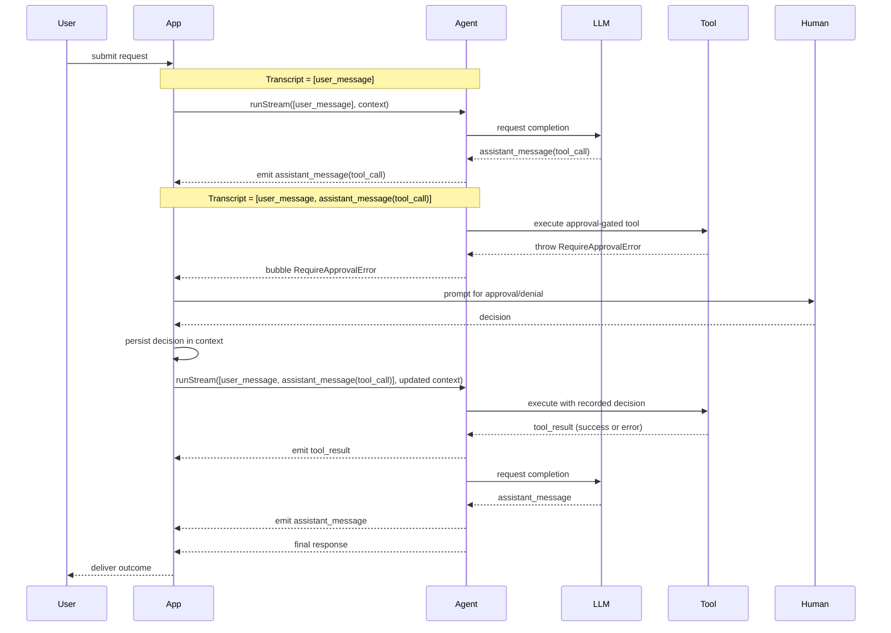

import { Aside, Code, TabItem, Tabs } from "@astrojs/starlight/components";
import goExample from "../../../../../agent-go/examples/require-approval/main.go?raw";
import jsExample from "../../../../../agent-js/examples/require-approval.ts?raw";
import rustExample from "../../../../../agent-rust/examples/require-approval.rs?raw";

<Aside>
  This is an agent pattern that requires custom implementation. [Why?](/agent/#agent-patterns)
</Aside>

Human-in-the-loop (HITL) adds people to the decision loop so agents can pause before risky actions, route questions to humans, and continue once someone signs off. In agentic systems this shows up everywhere:

- Compliance desks and policy reviews.
- Customer support escalations.
- **Coding agents before creating, editing, or deleting files**.

While the library does not have built-in HITL support, it provides the primitives to implement it yourself. One way to do this is to interrupt the agent run with an error when human input is needed, then replay the run once you have a decision.

At a high level:

1. Stream the run and keep the emitted [`AgentItem`](../run/#agent-items) history, even if an error occurs.
2. When a tool needs approval, throw a domain-specific error, such as `RequireApprovalError`. It halts the stream and bubbles up to your app.
3. Catch the error in your app, ask the human for a decision, stash that decision somewhere, and rerun the stream with the exact same transcript. Approved branches finish normally; denials surface an error result that the model can acknowledge in its reply.

This works because of the [Resumability](../resumability/) guarantee. It will reuse the same model response with the same tool calls, but the difference is that the tool execution will now succeed or fail based on the human decision.

## Implementation

<Aside>
  At the moment, the only way to implement this pattern is to use `run_stream`, as it gives you access to the intermediate items. I am revising the API to make this easier for `run` in the future.
</Aside>

The example implements this pattern using a minimal context that stores approval state in memory, a single tool that guards execution, a CLI prompt, and a loop that retries until the run finishes.

<Tabs>
  <TabItem label="TypeScript">
    <Code code={jsExample} lang="typescript" title="require-approval.ts" />
  </TabItem>
  <TabItem label="Rust">
    <Code code={rustExample} lang="rust" title="require-approval.rs" />
  </TabItem>
  <TabItem label="Go">
    <Code code={goExample} lang="go" title="main.go" />
  </TabItem>
</Tabs>
