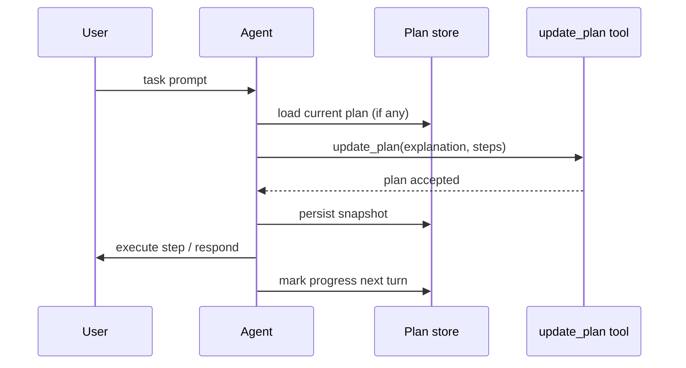

import { Aside, Code, TabItem, Tabs } from "@astrojs/starlight/components";
import goPlannerCode from "../../../../../agent-go/examples/planner-executor/main.go?raw";
import jsPlannerCode from "../../../../../agent-js/examples/planner-executor.ts?raw";
import rustPlannerCode from "../../../../../agent-rust/examples/planner-executor.rs?raw";

<Aside>
  This is an agent pattern that requires custom implementation. [Why?](/agent/#agent-patterns)
</Aside>

The planner-executor pattern gives the model a private to-do list so it can tackle multi-step complex requirements by breaking them down into manageable pieces.
It is popular for coding agents and investigative flows because the model can revise the plan between turns, mark items complete, and maintain chain-of-thought reasoning to carry out tasks efficiently and accurately.

Each cycle the model may adjust the plan before acting; your code may optionally inspect the proposal, tweak it if necessary, and persist the snapshot so you can resume later or render progress in the UI.

The only tool required is `update_plan` with payload `{ explanation?: string; plan: { status: "pending" | "in_progress" | "complete"; step: string; }[] }`, so validate it, cap the number of steps if you want, and reject plans that skip prerequisites. Well-crafted instructions remind the model to update the plan before long actions, mark finished items as `complete`, and keep the list short for clarity.

## Implementation

<Tabs>
  <TabItem label="TypeScript">
    <Code code={jsPlannerCode} lang="typescript" title="planner-executor.ts" />
  </TabItem>
  <TabItem label="Rust">
    <Code code={rustPlannerCode} lang="rust" title="planner-executor.rs" />
  </TabItem>
  <TabItem label="Go">
    <Code code={goPlannerCode} lang="go" title="main.go" />
  </TabItem>
</Tabs>

Pair this pattern with the [Run Session lifecycle](./agent-vs-run-session) so each user or request gets an isolated copy of the plan.
