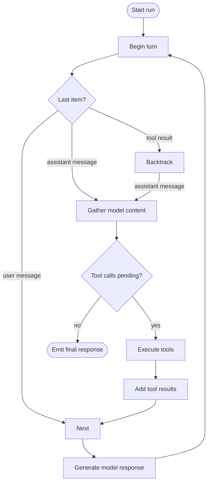

Runs across the agent libraries are deterministic so that a run can pick up exactly where it left off. The run logic can skip work that is already done and only generate a model response when strictly necessary. This page explains how that works and how to take advantage of it.

## How a run progresses

Each run stores its artifacts ([`AgentItems`](../run/#agent-items)) alongside the turn metadata. Every iteration inspects the most recent entries to decide the next action.

Key behaviors to know:

- The cycle always works from the latest assistant content, backtracking across existing tool results when necessary, and it treats user input as the signal to request another model response.
- Tool execution is idempotent. Each tool call carries a `tool_call_id`, and the loop skips tools whose results already exist in the run entries.
- When there are no pending tool calls, the run finalizes the response and returns an [`AgentResponse`](../run/#agent-response).

Because the cycle only advances when it needs another model turn, replaying a stored run is deterministic: the same state produces the same sequence of events.

For example:

- When the run returns a final response, re-feeding the same items back into a new run invocation immediately yields the same response without contacting the model again.
- If the input ends with an assistant message that requested tools, the run executes tools and only then generates a new model response.
- If the input ends with a tool result, the run backtracks to the preceding assistant message, inspects its content, and continues from there. If some tools have already been executed, it skips them and only runs the remaining ones before generating a model response.

## Using resumability in practice

You can pause or move a run to another process as long as you persist the accumulated `AgentItem` array. When you restore it, feed the items back into a new run invocation and let execution continue: tools that already ran will be skipped, and the model is contacted only if the last assistant message still needs a response.

This unlocks practical scenarios:

- Long-running workflows where individual tool calls may take minutes or require retries. Replay the run without duplicating successful steps.
- [Human-in-the-loop](../human-in-the-loop/) approvals: pause after emitting a tool request, store the state, and resume only once the approval arrives.
- Cross-environment execution: capture state in a background worker, ship it to a web worker or another server, and continue confidently knowing the behavior stays deterministic.

When coupled with toolkits and context binding, a run becomes a resumable controller that can survive restarts, manual interventions, or infrastructure changes without losing its place in the conversation. All of this comes for free without setting up checkpoints or specialized infrastructure. Just save the items and re-run them when you need to continue.
