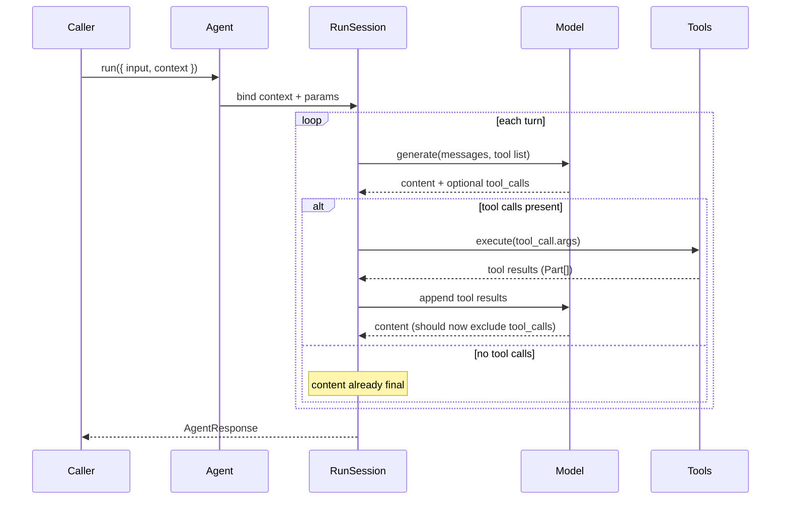
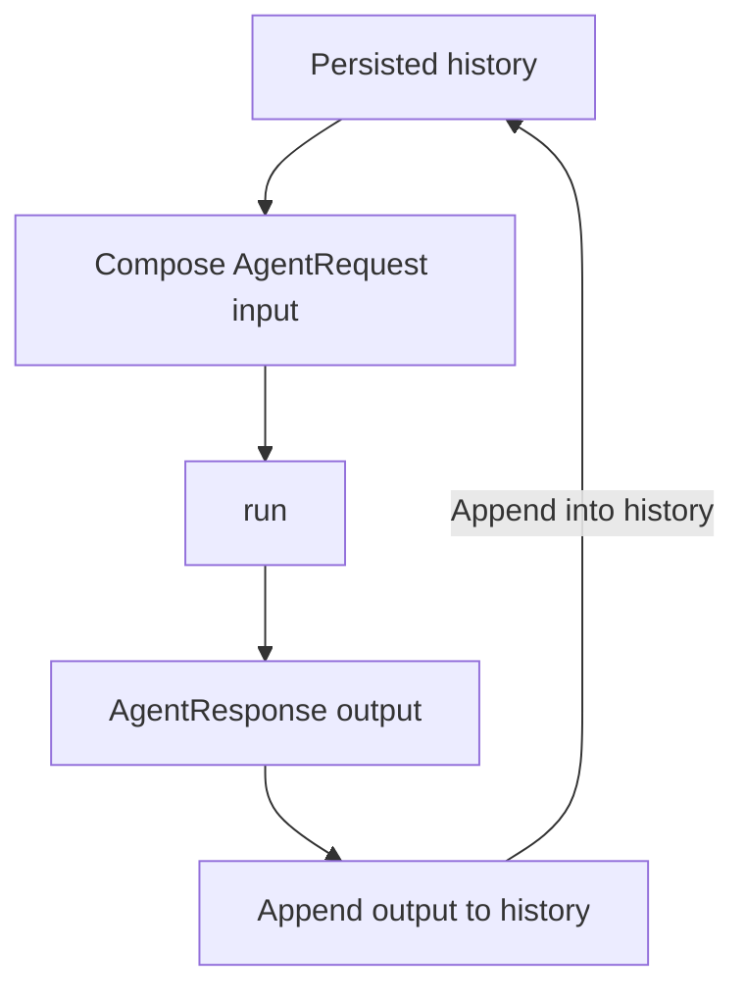

import { Aside, Code, TabItem, Tabs } from "@astrojs/starlight/components";
import {
  extractGoAgentTypes,
  extractRustAgentTypes,
  extractTypescriptAgentTypes,
} from "../../../utils/extract-types.ts";

Running an agent means wiring user input, model responses, and tool executions into a feedback loop. Each call to `run` (or `run_stream`) starts with the `AgentRequest` you provide, then the library drives the following cycle until it produces a final answer or hits a guard rail such as `max_turns`.

Behind the scenes the session tracks every intermediate item so you can append them to the next request and resume the conversation.

## Shaping the request

<Tabs>
  <TabItem label="TypeScript">
    <Code
      code={extractTypescriptAgentTypes(["AgentRequest"])}
      lang="typescript"
      title="types.ts"
    />
  </TabItem>
  <TabItem label="Rust">
    <Code
      code={extractRustAgentTypes(["AgentRequest"])}
      lang="rust"
      title="types.rs"
    />
  </TabItem>
  <TabItem label="Go">
    <Code
      code={extractGoAgentTypes(["AgentRequest"])}
      lang="go"
      title="types.go"
    />
  </TabItem>
</Tabs>

An `AgentRequest` combines two pieces:

- `input`: an ordered list of `AgentItem`s that represent the conversation you want the model to see.
- `context`: the per-run value passed to instructions, toolkits, and tools.

<Aside type="caution">
  Runs are stateless. The library never replays earlier items automatically, so persist what you need (for example in a database) and send the combined history back as the next request's `input`.
</Aside>

## Agent items

All inputs and outputs share the same `AgentItem` union, making it easy to stitch runs together. Each variant captures a different kind of turn artifact.

<Tabs>
  <TabItem label="TypeScript">
    <Code
      code={extractTypescriptAgentTypes([
        "AgentItem",
        "AgentItemMessage",
        "AgentItemModelResponse",
        "AgentItemTool",
      ])}
      lang="typescript"
      title="types.ts"
    />
  </TabItem>
  <TabItem label="Rust">
    <Code
      code={extractRustAgentTypes([
        "AgentItem",
        "AgentItemModelResponse",
        "AgentItemTool",
      ])}
      lang="rust"
      title="types.rs"
    />
  </TabItem>
  <TabItem label="Go">
    <Code
      code={extractGoAgentTypes([
        "AgentItem",
        "AgentItemTool",
        "AgentItemModelResponse",
      ])}
      lang="go"
      title="types.go"
    />
  </TabItem>
</Tabs>

- `AgentItemMessage`: user messages, assistant messages, and tool messages you collected before calling `run`. Use these to seed the conversation or to replay prior turns.
- `AgentItemModelResponse`: the model output produced during a run. It mirrors an assistant message but also carries usage and cost data. You can pass this back as input and it will be interpreted the same as an `AgentItemMessage` of `AssistantMessage`, yet the extra metadata is preserved for analytics.
- `AgentItemTool`: the full record of a tool invocation for the turn, including the call ID, arguments, model-selected tool name, tool output, and the `is_error` flag. Conceptually it has the same effect as passing an `AgentItemMessage` of `ToolMessage`, but the richer shape makes it easier to audit or replay tool interactions when you resume a session.

## Agent response

The `RunState` created per run (not exported directly) stitches these items together, constructs the `messages` payload for the model each turn, enforces `max_turns`, and ultimately produces the `AgentResponse`.

<Tabs>
  <TabItem label="TypeScript">
    <Code
      code={extractTypescriptAgentTypes(["AgentResponse"])}
      lang="typescript"
      title="types.ts"
    />
  </TabItem>
  <TabItem label="Rust">
    <Code
      code={extractRustAgentTypes(["AgentResponse"])}
      lang="rust"
      title="types.rs"
    />
  </TabItem>
  <TabItem label="Go">
    <Code
      code={extractGoAgentTypes(["AgentResponse"])}
      lang="go"
      title="types.go"
    />
  </TabItem>
</Tabs>

The `content` field is what you typically show to the user; `output` is the full list of items generated during the run and is the piece you should append to the next request's `input` when continuing the conversation.

## Streaming runs

`run_stream` emits progress as soon as the model responds or a tool finishes. You receive three event shapes, which align with the non-streaming artifacts:

<Tabs>
  <TabItem label="TypeScript">
    <Code
      code={extractTypescriptAgentTypes([
        "AgentStreamEvent",
        "AgentStreamEventPartial",
        "AgentStreamItemEvent",
        "AgentStreamResponseEvent",
      ])}
      lang="typescript"
      title="types.ts"
    />
  </TabItem>
  <TabItem label="Rust">
    <Code
      code={extractRustAgentTypes([
        "AgentStreamEvent",
        "AgentStreamItemEvent",
      ])}
      lang="rust"
      title="types.rs"
    />
  </TabItem>
  <TabItem label="Go">
    <Code
      code={extractGoAgentTypes([
        "AgentStreamEvent",
        "AgentStreamItemEvent",
      ])}
      lang="go"
      title="types.go"
    />
  </TabItem>
</Tabs>

- `AgentStreamEventPartial`: incremental deltas from the language model (for example, text chunks, audio samples). Use them to render streaming output.
- `AgentStreamItemEvent`: emitted whenever the run state records a new item (a model response or a tool call/result). This mirrors what will later show up in the `output` array of the final response.
- `AgentStreamResponseEvent`: fired once the run ends, bundling the same `AgentResponse` shape you get from non-streaming runs.

Use the stream when you want to surface partial answers, display tool progress, or fan out work while the run continues. The same items emitted during streaming will appear in the final `AgentResponse.output`, so you can rely on stream events for real-time UX and use the terminal response to persist state.
