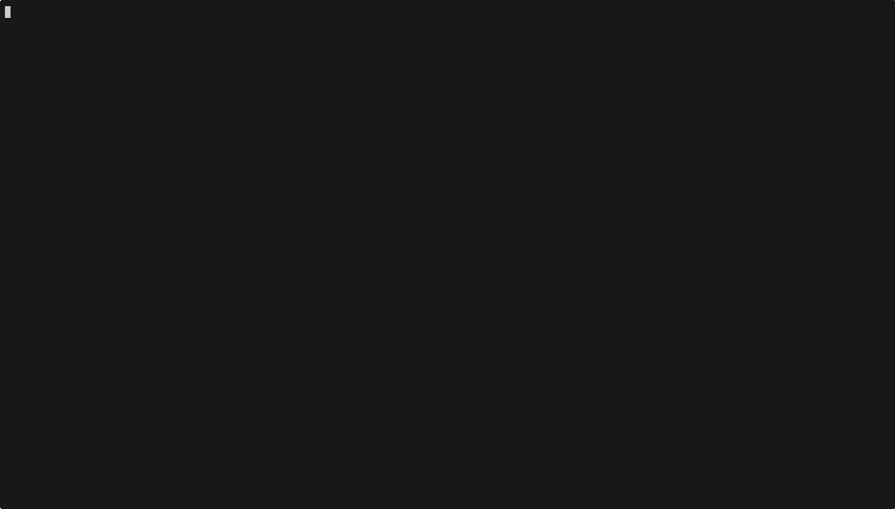

import { Code, TabItem, Tabs } from "@astrojs/starlight/components";
import goStructuredOutputCode from "../../../../../agent-go/examples/structured-output/main.go?raw";
import jsStructuredOutputCode from "../../../../../agent-js/examples/structured-output.ts?raw";
import rustStructuredOutputCode from "../../../../../agent-rust/examples/structured-output.rs?raw";

Agents can combine tools to generate a structured output.
Structured outputs are especially helpful when downstream systems expect typed data instead of free-form prose. Common production use cases include:

- **Ticket routing**: Map user intents into `{ category, severity, owner }` so incidents flow to the right queue automatically.
- **Data extraction**: Pull `{ company_name, amount, invoice_date }` from support chats and push to billing systems.
- **Workflow kicks-offs**: Produce `{ action, arguments }` payloads that can be directly executed by automation platforms (for example, Zapier or internal job runners).

Besides business use cases, structured outputs can also be used to implement agent patterns, such as Routing, RAG (answer with metadata), etc.

The structured output will come as a `TextPart` and require parsing into an object.

## Example

In the example below a "travel agent" orchestrates two tools, `search_flights` and `search_hotels`, and requires the language model to emit the final answer as JSON conforming to a `travel_plan` schema. The agent gathers flight and hotel options, merges them into the structured payload, and prints the parsed object so downstream systems can consume it without extra parsing heuristics.

<Tabs>
  <TabItem label="TypeScript">
    <Code
      code={jsStructuredOutputCode}
      lang="typescript"
      title="structured-output.ts"
    />
  </TabItem>
  <TabItem label="Rust">
    <Code
      code={rustStructuredOutputCode}
      lang="rust"
      title="structured-output.rs"
    />
  </TabItem>
  <TabItem label="Go">
    <Code code={goStructuredOutputCode} lang="go" title="main.go" />
  </TabItem>
</Tabs>
