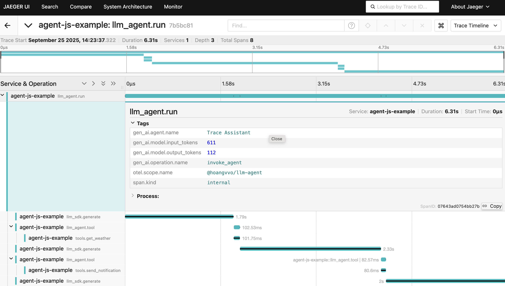

import { Aside, Code, TabItem, Tabs } from "@astrojs/starlight/components";
import goTracingExample from "../../../../../agent-go/examples/tracing/main.go?raw";
import jsTracingExample from "../../../../../agent-js/examples/tracing.ts?raw";
import rustTracingExample from "../../../../../agent-rust/examples/tracing.rs?raw";

Distributed tracing lets you follow a single request as it fans out across services, spans, and asynchronous work. Each hop in that request emits a *span* – a timed record that captures what happened, how long it took, and any data you attach. When spans share a trace context, your observability backend can stitch them into a timeline that exposes latency hot spots, errors, and the path taken through your system.

All agent libraries emit OpenTelemetry spans that follow the [Semantic Conventions for Generative AI Systems](https://opentelemetry.io/docs/specs/semconv/gen-ai/). You get high‑level visibility into the agent run itself, every tool invocation, and the underlying language model call made through the SDK. Because we rely on the standard OpenTelemetry APIs, any additional spans you create inside tool implementations (or downstream microservices they call) automatically participate in the same trace thanks to [distributed tracing](https://microservices.io/patterns/observability/distributed-tracing.html).

## Spans 

### Agent library

Each run produces the spans below. Names and attributes are consistent across TypeScript, Rust, and Go.

| Span name              | What it covers                                          | Key attributes                                                                                     |
| ---------------------- | ------------------------------------------------------- | --------------------------------------------------------------------------------------------------- |
| `llm_agent.run`        | Entire non-streaming run, from invocation to completion | `gen_ai.operation.name=invoke_agent`, `gen_ai.agent.name`, aggregated `gen_ai.model.*` usage tokens, `llm_agent.cost` |
| `llm_agent.run_stream` | Entire streaming run (start → final response/error)     | Same attributes as `llm_agent.run`; emitted once the stream finishes or terminates with an error |
| `llm_agent.tool`       | Each tool `execute` call (success or failure)           | `gen_ai.operation.name=execute_tool`, `gen_ai.tool.call.id`, `gen_ai.tool.name`, `gen_ai.tool.description`, `gen_ai.tool.type=function`, exception metadata when `execute` throws |

Tool spans wrap the entire `execute` handler, so any tracing you add inside runs as a child. If a tool calls out to other services that already emit telemetry, their spans join the same trace because the OpenTelemetry context is active for the duration of the tool call.

### SDK language model client

The SDK instruments all language model calls. Whenever an agent (or your own application) calls a `LanguageModel`, you will see:

| Span name            | What it covers                                           | Key attributes (subset)                                                                                                                                                                     |
| -------------------- | ------------------------------------------------------- | ------------------------------------------------------------------------------------------------------------------------------------------------------------------------------------------- |
| `llm_sdk.generate`   | Full synchronous `generate` call (start → finish/error) | `gen_ai.operation.name=generate_content`, `gen_ai.provider.name`, `gen_ai.request.model`, `gen_ai.usage.input_tokens`, `gen_ai.usage.output_tokens`, `llm_sdk.cost`, `gen_ai.request.temperature`, `gen_ai.request.max_tokens`, `gen_ai.request.top_p`, `gen_ai.request.top_k`, `gen_ai.request.presence_penalty`, `gen_ai.request.frequency_penalty`, `gen_ai.request.seed` |
| `llm_sdk.stream`     | Complete lifetime of `stream` (initial call + drain)    | Same attributes as `generate` plus `gen_ai.server.time_to_first_token` and incremental cost/usage tallied from partials                                                                                                       |

If an error bubbles up from the provider, the span status is set to `ERROR` and the exception is recorded, making it easy to spot call failures in tracing UIs.

## Enabling tracing

The examples below show identical agents across TS, Rust, and Go. Each run checks the weather for Seattle, then sends it to a contact—and produces spans beneath the agent root span.

<Tabs>
  <TabItem label="TypeScript">
    <Code code={jsTracingExample} lang="typescript" title="examples/tracing.ts" />
  </TabItem>
  <TabItem label="Rust">
    <Code code={rustTracingExample} lang="rust" title="examples/tracing.rs" />
  </TabItem>
  <TabItem label="Go">
    <Code code={goTracingExample} lang="go" title="examples/tracing/main.go" />
  </TabItem>
</Tabs>
