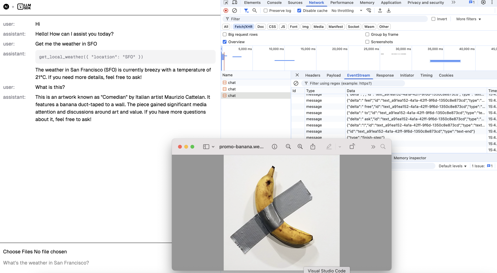

import { Code, TabItem, Tabs } from "@astrojs/starlight/components";
import goAdapter from "../../../../../agent-go/examples/ai-sdk-ui/main.go?raw";
import jsAdapter from "../../../../../agent-js/examples/ai-sdk-ui.ts?raw";
import rustAdapter from "../../../../../agent-rust/examples/ai-sdk-ui.rs?raw";

The [Vercel AI SDK](https://github.com/vercel/ai) gives us a unified surface for calling modern language models, while its UI library ([AI SDK UI](https://ai-sdk.dev/docs/ai-sdk-ui)) offers high-level hooks—`useChat`, `useCompletion`, and `useObject`—that manage inputs, streamed updates, and errors for you.
To plug llm-agent into that UI layer, we need to speak the SDK’s [Data Stream Protocol](https://ai-sdk.dev/docs/ai-sdk-ui/stream-protocol) over Server-Sent Events (SSE).

> The adapter shown here lives in the examples directory today. It is **not** bundled with the core packages yet.

Using the code in this guide enables integrating [ai-sdk](https://www.npmjs.com/package/ai) with any llm-sdk/llm-agent backend, including in Go and Rust, not just Node.js.

## Example adapter

Each agent package ships an `examples/ai-sdk-ui` project that does two jobs:

1. Rehydrate the AI SDK UI request history with its [UIMessage](https://ai-sdk.dev/docs/reference/ai-sdk-core/ui-message#uimessage) into llm-agent `AgentItem`s.
2. Translate `AgentStreamEvent`s into the protocol’s `start`, `*-delta`, `*-end`, `tool-*`, and `finish` messages, writing them to an SSE response with the `x-vercel-ai-ui-message-stream: v1` header.

Below is the full reference implementation in every runtime. Choose the one that matches your stack and adapt it to your server framework.

The repository also includes a [Next.js frontend](https://github.com/hoangvvo/llm-sdk/tree/main/examples/next-ai-sdk-ui) that uses the AI SDK UI hooks to connect to any of these backends for testing.

<Tabs>
  <TabItem label="TypeScript">
    <Code code={jsAdapter} lang="typescript" title="agent-js/examples/ai-sdk-ui.ts" />
  </TabItem>
  <TabItem label="Go">
    <Code code={goAdapter} lang="go" title="agent-go/examples/ai-sdk-ui/main.go" />
  </TabItem>
  <TabItem label="Rust">
    <Code code={rustAdapter} lang="rust" title="agent-rust/examples/ai-sdk-ui.rs" />
  </TabItem>
</Tabs>
