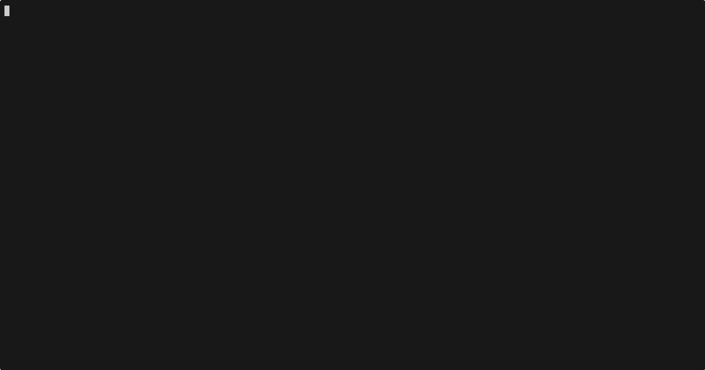

import { Code, TabItem, Tabs } from "@astrojs/starlight/components";
import goSummarizeAudio from "../../../../../sdk-go/examples/summarize-audio/main.go?raw";
import jsSummarizeAudio from "../../../../../sdk-js/examples/summarize-audio.ts?raw";
import rustSummarizeAudio from "../../../../../sdk-rust/examples/summarize-audio.rs?raw";
import {
  extractGoTypes,
  extractRustTypes,
  extractTypescriptTypes,
} from "../../../utils/extract-types.ts";

Audio can be sent to the model using an `AudioPart`. 

<Tabs>
  <TabItem label="TypeScript">
    <Code
      code={extractTypescriptTypes(["AudioPart", "AudioFormat"])}
      lang="typescript"
      title="types.ts"
    />
  </TabItem>
  <TabItem label="Rust">
    <Code
      code={extractRustTypes(["AudioPart", "AudioFormat"])}
      lang="rust"
      title="types.rs"
    />
  </TabItem>
  <TabItem label="Go">
    <Code
      code={extractGoTypes(["AudioPart", "AudioFormat"])}
      lang="go"
      title="types.go"
    />
  </TabItem>
</Tabs>

This enables use cases such as:

- Transcribing audio to text
- Summarizing spoken content
- Analyzing sentiment in speech

<Tabs>
  <TabItem label="TypeScript">
    <Code lang="ts" code={jsSummarizeAudio} title="summarize-audio.ts" />
  </TabItem>
  <TabItem label="Rust">
    <Code
      lang="rs"
      code={rustSummarizeAudio}
      title="summarize-audio.rs"
    />
  </TabItem>
  <TabItem label="Go">
    <Code
      lang="go"
      code={goSummarizeAudio}
      title="main.go"
    />
  </TabItem>
</Tabs>
