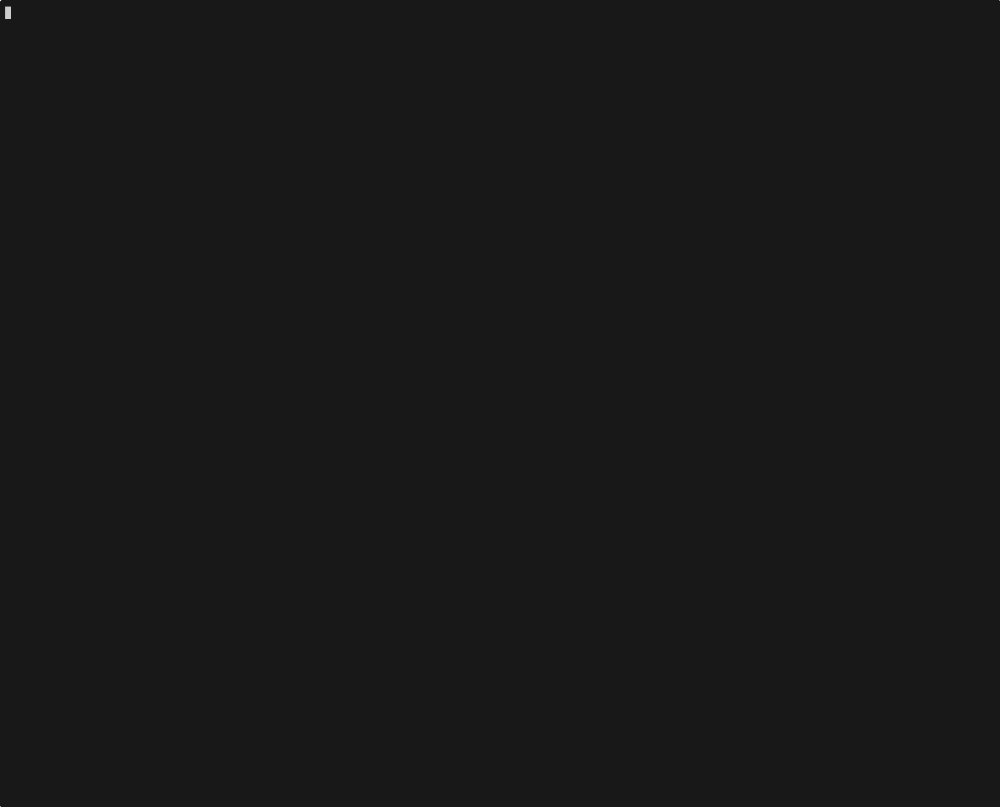

import { Code, TabItem, Tabs } from "@astrojs/starlight/components";
import goGenerateCitationsCode from "../../../../../sdk-go/examples/generate-citations/main.go?raw";
import goStreamCitationsCode from "../../../../../sdk-go/examples/stream-citations/main.go?raw";
import jsGenerateCitationsCode from "../../../../../sdk-js/examples/generate-citations.ts?raw";
import jsStreamCitationsCode from "../../../../../sdk-js/examples/stream-citations.ts?raw";
import rustGenerateCitationsCode from "../../../../../sdk-rust/examples/generate_citations.rs?raw";
import rustStreamCitationsCode from "../../../../../sdk-rust/examples/stream_citations.rs?raw";
import {
  extractGoTypes,
  extractRustTypes,
  extractTypescriptTypes,
} from "../../../utils/extract-types.ts";

Citation-enabled models can attribute parts of their responses back to specific source documents. The SDK represents this with `SourcePart` inputs and `Citation` metadata that appears alongside text output.

`SourcePart` carries the structured document content the model can cite. It can be added directly to the conversation history or returned from tools.

<Tabs>
  <TabItem label="TypeScript">
    <Code
      code={extractTypescriptTypes([
        "SourcePart",
      ])}
      lang="typescript"
      title="types.ts"
    />
  </TabItem>
  <TabItem label="Rust">
    <Code
      code={extractRustTypes([
        "SourcePart",
      ])}
      lang="rust"
      title="types.rs"
    />
  </TabItem>
  <TabItem label="Go">
    <Code
      code={extractGoTypes([
        "SourcePart",
      ])}
      lang="go"
      title="types.go"
    />
  </TabItem>
</Tabs>

When a model returns an attributed answer it adds `Citation` entries to the generated `TextPart`.

<Tabs>
  <TabItem label="TypeScript">
    <Code
      code={extractTypescriptTypes([
        "TextPart",
        "Citation",
      ])}
      lang="typescript"
      title="types.ts"
    />
  </TabItem>
  <TabItem label="Rust">
    <Code
      code={extractRustTypes([
        "TextPart",
        "Citation",
      ])}
      lang="rust"
      title="types.rs"
    />
  </TabItem>
  <TabItem label="Go">
    <Code
      code={extractGoTypes([
        "TextPart",
        "Citation",
      ])}
      lang="go"
      title="types.go"
    />
  </TabItem>
</Tabs>

Before we look at concrete requests, it helps to understand how citation spans
break large passages into multiple `TextPart`s.

In this case, 2 of the `TextPart`s contain `Citation` entries that point to the relevant source documents. The other `TextPart`s contain only text.

## Generate citations

Include `SourcePart` entries in your messages (either directly from the user or via tool outputs) so the model can ground its response. Each source needs a stable `source` identifier or URL, a human-readable `title`, and the document `content` broken into structured parts.

Use `generate()` when you want a single response that includes citations. The SDK returns `TextPart` objects whose `citations` array points to the matching `source` identifiers and spans within your provided documents.

<Tabs>
  <TabItem label="TypeScript">
    <Code
      code={jsGenerateCitationsCode}
      lang="typescript"
      title="generate-citations.ts"
    />
  </TabItem>
  <TabItem label="Rust">
    <Code
      code={rustGenerateCitationsCode}
      lang="rust"
      title="generate_citations.rs"
    />
  </TabItem>
  <TabItem label="Go">
    <Code
      code={goGenerateCitationsCode}
      lang="go"
      title="main.go"
    />
  </TabItem>
</Tabs>

## Stream citations

During streaming, citation information arrives incrementally as `CitationDelta` objects nested inside `TextPartDelta` updates.

<Tabs>
  <TabItem label="TypeScript">
    <Code
      code={extractTypescriptTypes([
        "TextPartDelta",
        "CitationDelta",
      ])}
      lang="typescript"
      title="types.ts"
    />
  </TabItem>
  <TabItem label="Rust">
    <Code
      code={extractRustTypes([
        "TextPartDelta",
        "CitationDelta",
      ])}
      lang="rust"
      title="types.rs"
    />
  </TabItem>
  <TabItem label="Go">
    <Code
      code={extractGoTypes([
        "TextPartDelta",
        "CitationDelta",
      ])}
      lang="go"
      title="types.go"
    />
  </TabItem>
</Tabs>

When you stream responses, `TextPartDelta` chunks include optional `citation` deltas. Accumulate the stream with the provided `StreamAccumulator` so citations and text are merged safely in arrival order.

<Tabs>
  <TabItem label="TypeScript">
    <Code
      code={jsStreamCitationsCode}
      lang="typescript"
      title="stream-citations.ts"
    />
  </TabItem>
  <TabItem label="Rust">
    <Code
      code={rustStreamCitationsCode}
      lang="rust"
      title="stream_citations.rs"
    />
  </TabItem>
  <TabItem label="Go">
    <Code
      code={goStreamCitationsCode}
      lang="go"
      title="main.go"
    />
  </TabItem>
</Tabs>
