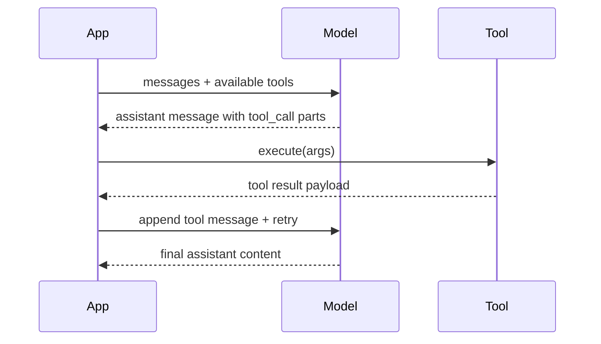

import { Code, TabItem, Tabs } from "@astrojs/starlight/components";
import goToolUseCode from "../../../../../sdk-go/examples/tool-use/main.go?raw";
import jsToolUseCode from "../../../../../sdk-js/examples/tool-use.ts?raw";
import rustToolUseCode from "../../../../../sdk-rust/examples/tool-use.rs?raw";
import {
  extractGoTypes,
  extractRustTypes,
  extractTypescriptTypes,
} from "../../../utils/extract-types.ts";

Function calling lets the model request work from your own code. You describe possible functions as tools, the model decides when to call them, and you send the results back so it can continue the conversation.

## Request/response loop

The loop continues until the model returns regular assistant content (no tool call parts) or you stop the interaction. Each tool call is explicit, so you stay in control of side effects and error handling.

## Describe the tools you expose

Create one entry per callable function. The schema tells the model which arguments are expected.

<Tabs>
  <TabItem label="TypeScript">
    <Code
      code={extractTypescriptTypes(["Tool"])}
      lang="typescript"
      title="types.ts"
    />
  </TabItem>
  <TabItem label="Rust">
    <Code
      code={extractRustTypes(["Tool"])}
      lang="rust"
      title="types.rs"
    />
  </TabItem>
  <TabItem label="Go">
    <Code
      code={extractGoTypes(["Tool"])}
      lang="go"
      title="types.go"
    />
  </TabItem>
</Tabs>

Include these tools when you call the model. In the streaming APIs, pass them on every turn.

## Detect tool calls from the model

When the model wants to call something, the assistant message carries one or more [`ToolCallPart`](../language-model/#tool-call-part)s. Each part includes the tool name and JSON arguments that you must parse before executing your own code.

<Tabs>
  <TabItem label="TypeScript">
    <Code
      code={extractTypescriptTypes(["ToolCallPart"])}
      lang="typescript"
      title="types.ts"
    />
  </TabItem>
  <TabItem label="Rust">
    <Code
      code={extractRustTypes(["ToolCallPart"])}
      lang="rust"
      title="types.rs"
    />
  </TabItem>
  <TabItem label="Go">
    <Code
      code={extractGoTypes(["ToolCallPart"])}
      lang="go"
      title="types.go"
    />
  </TabItem>
</Tabs>

Execute each requested function in your application. Handle failures yourself--if you return an error payload the model can choose a different strategy or ask for clarification.

## Return the results as a tool message

After execution, respond with a single `ToolMessage` that contains one or more [`ToolResultPart`](../language-model/#tool-result-part)s for every call you serviced. The model uses these results to continue reasoning or to compose the final answer.

<Tabs>
  <TabItem label="TypeScript">
    <Code
      code={extractTypescriptTypes(["ToolMessage", "ToolResultPart"])}
      lang="typescript"
      title="types.ts"
    />
  </TabItem>
  <TabItem label="Rust">
    <Code
      code={extractRustTypes(["ToolMessage", "ToolResultPart"])}
      lang="rust"
      title="types.rs"
    />
  </TabItem>
  <TabItem label="Go">
    <Code
      code={extractGoTypes(["ToolMessage", "ToolResultPart"])}
      lang="go"
      title="types.go"
    />
  </TabItem>
</Tabs>

Append both the assistant message that requested the tool and your tool message to the conversation, then call the model again. Repeat until you get a regular assistant response.

## End-to-end example

Below is a minimal loop that wires everything together. The logic is what drives the [Agent library](/agent) internally.

<Tabs>
  <TabItem label="TypeScript">
    <Code code={jsToolUseCode} lang="typescript" title="tool-use.ts" />
  </TabItem>
  <TabItem label="Rust">
    <Code code={rustToolUseCode} lang="rust" title="tool-use.rs" />
  </TabItem>
  <TabItem label="Go">
    <Code code={goToolUseCode} lang="go" title="main.go" />
  </TabItem>
</Tabs>
