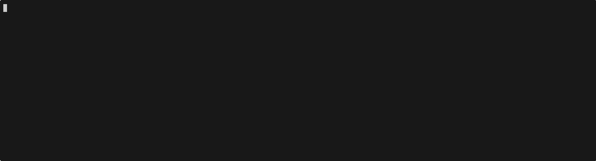

import { Code, TabItem, Tabs } from "@astrojs/starlight/components";
import goDescribeImageCode from "../../../../../sdk-go/examples/describe-image/main.go?raw";
import jsDescribeImageCode from "../../../../../sdk-js/examples/describe-image.ts?raw";
import rustDescribeImageCode from "../../../../../sdk-rust/examples/describe-image.rs?raw";
import {
  extractGoTypes,
  extractRustTypes,
  extractTypescriptTypes,
} from "../../../utils/extract-types.ts";
import { extractCombined } from "../../../utils/treesitter-extract.ts";

Image modality is represented as `ImagePart`s.

<Tabs>
  <TabItem label="TypeScript">
    <Code
      code={extractTypescriptTypes(["ImagePart"])}
      lang="typescript"
      title="types.ts"
    />
  </TabItem>
  <TabItem label="Rust">
    <Code
      code={extractRustTypes(["ImagePart"])}
      lang="rust"
      title="types.rs"
    />
  </TabItem>
  <TabItem label="Go">
    <Code
      code={extractGoTypes(["ImagePart"])}
      lang="go"
      title="types.go"
    />
  </TabItem>
</Tabs>

Images can be sent to the model as `ImagePart` objects.

<Tabs>
  <TabItem label="TypeScript">
    <Code
      code={jsDescribeImageCode}
      lang="typescript"
      title="describe-image.ts"
    />
  </TabItem>
  <TabItem label="Rust">
    <Code code={rustDescribeImageCode} lang="rust" title="describe-image.rs" />
  </TabItem>
  <TabItem label="Go">
    <Code code={goDescribeImageCode} lang="go" title="main.go" />
  </TabItem>
</Tabs>
