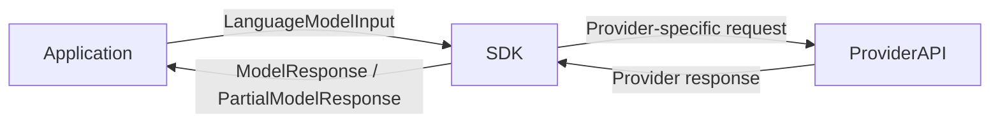

We provide SDKs to interact with various LLM providers in the following programming languages:

- [JavaScript](https://github.com/hoangvvo/llm-sdk/tree/main/sdk-js)
- [Rust](https://github.com/hoangvvo/llm-sdk/tree/main/sdk-rust)
- [Go](https://github.com/hoangvvo/llm-sdk/tree/main/sdk-go)

Each SDK wraps the same core model abstractions so you can:

- Call text, image, audio, and reasoning models with a unified [`LanguageModel`](../language-model/) interface.
- Stream partial responses and accumulate them into final outputs.
- Register tools/function calls and handle tool-call responses consistently.
- Parse structured output schemas when you need typed results.

Pick the SDK that matches your stack to integrate the same capabilities in different services while keeping request and response handling aligned.

All three SDKs serialize requests and responses identically, so services written in different languages can pass [`LanguageModelInput`](../language-model/#language-model-input), and [`ModelResponse`](../language-model/#model-response) data without translation. That makes it painless to mix runtimes or rewrite a component (for example, from JavaScript to Go or Rust) without changing how downstream systems consume LLM responses.
