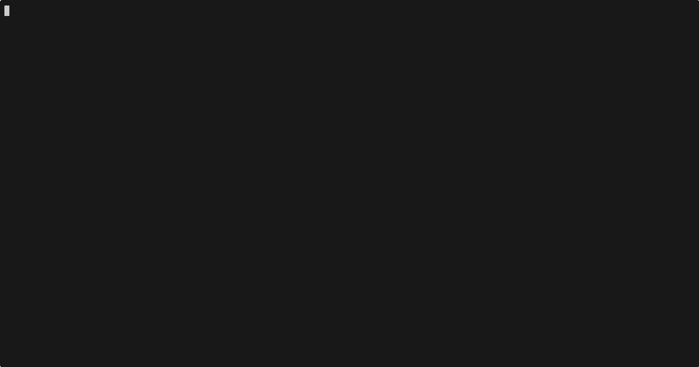

import { Code, TabItem, Tabs } from "@astrojs/starlight/components";
import goStructuredOutputCode from "../../../../../sdk-go/examples/structured-output/main.go?raw";
import jsStructuredOutputCode from "../../../../../sdk-js/examples/structured-output.ts?raw";
import rustStructuredOutputCode from "../../../../../sdk-rust/examples/structured-output.rs?raw";

We can ask the model to return a structured output by specifying a response format.
The structured output will come as a `TextPart` and require parsing into an object.

<Tabs>
  <TabItem label="TypeScript">
    <Code
      code={jsStructuredOutputCode}
      lang="typescript"
      title="structured-output.ts"
    />
  </TabItem>
  <TabItem label="Rust">
    <Code
      code={rustStructuredOutputCode}
      lang="rust"
      title="structured-output.rs"
    />
  </TabItem>
  <TabItem label="Go">
    <Code code={goStructuredOutputCode} lang="go" title="main.go" />
  </TabItem>
</Tabs>